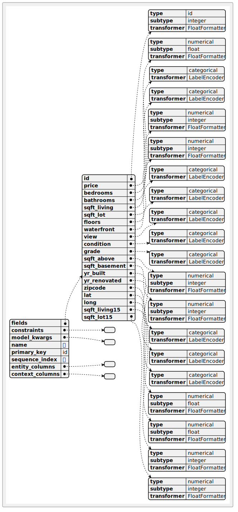

## memoria-uchile
# Data Sintética Privada, Generación Vía Modelo Deep Learning
[Link](https://docs.google.com/document/d/1Y4JAyeCSBADCZPokOMzrGdkT5LfFzUcAx6ybxM0UyXc/edit)

## Como utilizar
Instalaciones
```
pip install github
---
python3 synthetic_ml/setup.py develop
```

## Datasets

### KingCounty

#### Descripción
```bash
dvc get datasets/kingcounty/kc_house_data.csv
python3 -c "import pandas as pd;df = pd.read_csv('datasets/kingcounty/raw/kc_house_data.csv');print(df.sample(3).to_markdown(index=False))" > viz/kingcounty/sample_3.md
```
|         id | date            |   price |   bedrooms |   bathrooms |   sqft_living |   sqft_lot |   floors |   waterfront |   view |   condition |   grade |   sqft_above |   sqft_basement |   yr_built |   yr_renovated |   zipcode |     lat |     long |   sqft_living15 |   sqft_lot15 |
|-----------:|:----------------|--------:|-----------:|------------:|--------------:|-----------:|---------:|-------------:|-------:|------------:|--------:|-------------:|----------------:|-----------:|---------------:|----------:|--------:|---------:|----------------:|-------------:|
| 5067400162 | 20150218T000000 |  290000 |          3 |           2 |          1550 |      18958 |      1.5 |            0 |      0 |           3 |       7 |         1550 |               0 |       1983 |              0 |     98198 | 47.3699 | -122.319 |            1840 |        12826 |
| 5269200050 | 20150305T000000 |  175000 |          2 |           1 |           700 |       8174 |      1   |            0 |      0 |           3 |       5 |          700 |               0 |       1941 |              0 |     98146 | 47.5136 | -122.349 |            1250 |         8046 |
| 1623049145 | 20140925T000000 |  210000 |          2 |           1 |           880 |       9750 |      1   |            0 |      0 |           5 |       6 |          880 |               0 |       1938 |              0 |     98168 | 47.4885 | -122.298 |            1220 |         9406 |

### Metadata
```
(cd datasets/kingcounty/diagrams && plantuml metadata.puml -tsvg -o ../images/diagrams/)
```
 

### Estadisticos
```bash
python3 -c 'from syntheticml.syntools.extractor import stats_csv_cat_con;a,b = stats_csv_cat_con("datasets/kingcounty/raw/kc_house_data.csv", "datasets/kingcounty/metadata.json");print(a.to_markdown());print(b.to_markdown())'
```
|                  | bathrooms                                                                                                 | bedrooms                                                                                                | price                                                                                                            | sqft_above                                                                                                    | sqft_basement                                                                                               | sqft_living                                                                                                      | sqft_living15                                                                                                  | sqft_lot                                                                                                      | sqft_lot15                                                                                                     |
|:-----------------|:----------------------------------------------------------------------------------------------------------|:--------------------------------------------------------------------------------------------------------|:-----------------------------------------------------------------------------------------------------------------|:--------------------------------------------------------------------------------------------------------------|:------------------------------------------------------------------------------------------------------------|:-----------------------------------------------------------------------------------------------------------------|:---------------------------------------------------------------------------------------------------------------|:--------------------------------------------------------------------------------------------------------------|:---------------------------------------------------------------------------------------------------------------|
| nobs             | 21613.0                                                                                                   | 21613.0                                                                                                 | 21613.0                                                                                                          | 21613.0                                                                                                       | 21613.0                                                                                                     | 21613.0                                                                                                          | 21613.0                                                                                                        | 21613.0                                                                                                       | 21613.0                                                                                                        |
| missing          | 0.0                                                                                                       | 0.0                                                                                                     | 0.0                                                                                                              | 0.0                                                                                                           | 0.0                                                                                                         | 0.0                                                                                                              | 0.0                                                                                                            | 0.0                                                                                                           | 0.0                                                                                                            |
| mean             | 2.1147573219821405                                                                                        | 3.37084162309721                                                                                        | 540088.1417665294                                                                                                | 1788.3906907879516                                                                                            | 291.5090454818859                                                                                           | 2079.8997362698374                                                                                               | 1986.552491556008                                                                                              | 15106.967565816869                                                                                            | 12768.455651691113                                                                                             |
| std_err          | 3.563425518057382e-05                                                                                     | 4.3032518907483996e-05                                                                                  | 16.986406166783873                                                                                               | 0.03831448561754115                                                                                           | 0.020477261031669282                                                                                        | 0.04249483630439141                                                                                              | 0.031711992978891296                                                                                           | 1.916462847135311                                                                                             | 1.263322057619882                                                                                              |
| upper_ci         | 2.1148271638389105                                                                                        | 3.3709259652844326                                                                                      | 540121.4345108431                                                                                                | 1788.4657857998482                                                                                            | 291.54918017601                                                                                             | 2079.983024618523                                                                                                | 1986.6146459201245                                                                                             | 15110.723763974964                                                                                            | 12770.931717424923                                                                                             |
| lower_ci         | 2.1146874801253706                                                                                        | 3.370757280909987                                                                                       | 540054.8490222157                                                                                                | 1788.315595776055                                                                                             | 291.4689107877618                                                                                           | 2079.816447921152                                                                                                | 1986.4903371918913                                                                                             | 15103.211367658774                                                                                            | 12765.979585957302                                                                                             |
| std              | 0.770163157217742                                                                                         | 0.9300618311474517                                                                                      | 367127.19648269983                                                                                               | 828.0909776519169                                                                                             | 442.5750426774682                                                                                           | 918.4408970468115                                                                                                | 685.3913042527776                                                                                              | 41420.51151513548                                                                                             | 27304.17963133851                                                                                              |
| iqr              | 0.75                                                                                                      | 1.0                                                                                                     | 323050.0                                                                                                         | 1020.0                                                                                                        | 560.0                                                                                                       | 1123.0                                                                                                           | 870.0                                                                                                          | 5648.0                                                                                                        | 4983.0                                                                                                         |
| iqr_normal       | 0.5559758319396008                                                                                        | 0.741301109252801                                                                                       | 239477.32334411735                                                                                               | 756.127131437857                                                                                              | 415.1286211815685                                                                                           | 832.4811456908955                                                                                                | 644.9319650499368                                                                                              | 4186.86866505982                                                                                              | 3693.903427406707                                                                                              |
| mad              | 0.6153609574123702                                                                                        | 0.7349548335864433                                                                                      | 233941.72427250765                                                                                               | 640.3860357447825                                                                                             | 363.2358667531935                                                                                           | 698.3239195730996                                                                                                | 536.2192072705565                                                                                              | 13837.264222627142                                                                                            | 10118.6607095847                                                                                               |
| mad_normal       | 0.7712405874769249                                                                                        | 0.9211292832222502                                                                                      | 293202.47033869853                                                                                               | 802.6048719383651                                                                                             | 455.24864698182665                                                                                          | 875.219240826538                                                                                                 | 672.0511131722989                                                                                              | 17342.438871988572                                                                                            | 12681.860518021394                                                                                             |
| coef_var         | 0.3641851238495185                                                                                        | 0.2759138325498926                                                                                      | 0.6797542254527085                                                                                               | 0.4630369537917166                                                                                            | 1.5182206162620413                                                                                          | 0.44157940934882495                                                                                              | 0.34501545122320465                                                                                            | 2.7418150819929807                                                                                            | 2.138408933403173                                                                                              |
| range            | 8.0                                                                                                       | 33.0                                                                                                    | 7625000.0                                                                                                        | 9120.0                                                                                                        | 4820.0                                                                                                      | 13250.0                                                                                                          | 5811.0                                                                                                         | 1650839.0                                                                                                     | 870549.0                                                                                                       |
| max              | 8.0                                                                                                       | 33.0                                                                                                    | 7700000.0                                                                                                        | 9410.0                                                                                                        | 4820.0                                                                                                      | 13540.0                                                                                                          | 6210.0                                                                                                         | 1651359.0                                                                                                     | 871200.0                                                                                                       |
| min              | 0.0                                                                                                       | 0.0                                                                                                     | 75000.0                                                                                                          | 290.0                                                                                                         | 0.0                                                                                                         | 290.0                                                                                                            | 399.0                                                                                                          | 520.0                                                                                                         | 651.0                                                                                                          |
| skew             | 0.5110721004310892                                                                                        | 1.9741625111266883                                                                                      | 4.023789858140135                                                                                                | 1.4465640690628738                                                                                            | 1.577855538493433                                                                                           | 1.4714532949510901                                                                                               | 1.108104363669749                                                                                              | 13.059112541314752                                                                                            | 9.50608344063878                                                                                               |
| kurtosis         | 4.279328769993111                                                                                         | 52.05202582325276                                                                                       | 37.577262255687536                                                                                               | 6.40123897796057                                                                                              | 5.714668427210353                                                                                           | 8.24160252161377                                                                                                 | 4.596448760806132                                                                                              | 288.01159582778826                                                                                            | 153.72795683083365                                                                                             |
| jarque_bera      | 2414.767240150196                                                                                         | 2180833.2060868507                                                                                      | 1134998.2338603418                                                                                               | 17955.555392145                                                                                               | 15604.52932991282                                                                                           | 32541.159749433467                                                                                               | 6718.247749905223                                                                                              | 73766764.25352126                                                                                             | 20784843.386134733                                                                                             |
| jarque_bera_pval | 0.0                                                                                                       | 0.0                                                                                                     | 0.0                                                                                                              | 0.0                                                                                                           | 0.0                                                                                                         | 0.0                                                                                                              | 0.0                                                                                                            | 0.0                                                                                                           | 0.0                                                                                                            |
| mode             | 2.5                                                                                                       | 3.0                                                                                                     | 350000.0                                                                                                         | 1300.0                                                                                                        | 0.0                                                                                                         | 1300.0                                                                                                           | 1540.0                                                                                                         | 5000.0                                                                                                        | 5000.0                                                                                                         |
| mode_freq        | 0.24892425854809605                                                                                       | 0.4545412483227687                                                                                      | 0.007958173321611993                                                                                             | 0.009808911303382224                                                                                          | 0.6073196687179012                                                                                          | 0.0063850460371072965                                                                                            | 0.009114884560218387                                                                                           | 0.016564104936843568                                                                                          | 0.019756627955397215                                                                                           |
| median           | 2.25                                                                                                      | 3.0                                                                                                     | 450000.0                                                                                                         | 1560.0                                                                                                        | 0.0                                                                                                         | 1910.0                                                                                                           | 1840.0                                                                                                         | 7618.0                                                                                                        | 7620.0                                                                                                         |
| 0.1%             | 0.75                                                                                                      | 1.0                                                                                                     | 95000.0                                                                                                          | 512.24                                                                                                        | 0.0                                                                                                         | 520.0                                                                                                            | 746.12                                                                                                         | 711.0                                                                                                         | 886.0                                                                                                          |
| 1.0%             | 1.0                                                                                                       | 2.0                                                                                                     | 153500.36                                                                                                        | 700.0                                                                                                         | 0.0                                                                                                         | 720.0                                                                                                            | 950.0                                                                                                          | 1013.12                                                                                                       | 1191.24                                                                                                        |
| 5.0%             | 1.0                                                                                                       | 2.0                                                                                                     | 210000.0                                                                                                         | 850.0                                                                                                         | 0.0                                                                                                         | 940.0                                                                                                            | 1140.0                                                                                                         | 1800.0                                                                                                        | 1999.2000000000003                                                                                             |
| 25.0%            | 1.75                                                                                                      | 3.0                                                                                                     | 321950.0                                                                                                         | 1190.0                                                                                                        | 0.0                                                                                                         | 1427.0                                                                                                           | 1490.0                                                                                                         | 5040.0                                                                                                        | 5100.0                                                                                                         |
| 75.0%            | 2.5                                                                                                       | 4.0                                                                                                     | 645000.0                                                                                                         | 2210.0                                                                                                        | 560.0                                                                                                       | 2550.0                                                                                                           | 2360.0                                                                                                         | 10688.0                                                                                                       | 10083.0                                                                                                        |
| 95.0%            | 3.5                                                                                                       | 5.0                                                                                                     | 1156479.9999999974                                                                                               | 3400.0                                                                                                        | 1190.0                                                                                                      | 3760.0                                                                                                           | 3300.0                                                                                                         | 43339.19999999996                                                                                             | 37062.799999999974                                                                                             |
| 99.0%            | 4.25                                                                                                      | 6.0                                                                                                     | 1964400.0000000051                                                                                               | 4370.0                                                                                                        | 1660.0                                                                                                      | 4978.80000000001                                                                                                 | 4080.0                                                                                                         | 213008.0                                                                                                      | 157687.0                                                                                                       |
| 99.9%            | 5.5                                                                                                       | 8.0                                                                                                     | 3476301.6000003926                                                                                               | 6113.8800000000265                                                                                            | 2371.6400000000795                                                                                          | 7289.400000000132                                                                                                | 5011.640000000079                                                                                              | 495876.356000016                                                                                              | 302993.20000003284                                                                                             |
| mean_5_95        | 2.0635431568907965                                                                                        | 3.3476527270138132                                                                                      | 495023.83424734767                                                                                               | 1722.1165187958356                                                                                            | 229.10110007788163                                                                                          | 2013.3535607851197                                                                                               | 1939.513519060079                                                                                              | 9232.059047227503                                                                                             | 8662.574674823916                                                                                              |
| tstd_5_95        | 0.683005093690175                                                                                         | 0.8005205579747403                                                                                      | 204647.419823328                                                                                                 | 626.6651736649862                                                                                             | 348.8112675163367                                                                                           | 675.8453558893806                                                                                                | 525.0942427170756                                                                                              | 6647.790516975424                                                                                             | 5443.1182875963                                                                                                |
| top5             | ('2.5', '1.0', '1.75', '2.25', '2.0')                                                                     | ('3', '4', '2', '5', '6')                                                                               | ('350000.0', '450000.0', '550000.0', '500000.0', '425000.0')                                                     | ('1300', '1010', '1200', '1220', '1140')                                                                      | ('0', '600', '700', '500', '800')                                                                           | ('1300', '1400', '1440', '1800', '1010')                                                                         | ('1540', '1440', '1560', '1500', '1460')                                                                       | ('5000', '6000', '4000', '7200', '4800')                                                                      | ('5000', '4000', '6000', '7200', '4800')                                                                       |
| top5_freq        | (5380, 3852, 3048, 2047, 1930)                                                                            | (9824, 6882, 2760, 1601, 272)                                                                           | (172, 172, 159, 152, 150)                                                                                        | (212, 210, 206, 192, 184)                                                                                     | (13126, 221, 218, 214, 206)                                                                                 | (138, 135, 133, 129, 129)                                                                                        | (197, 195, 192, 181, 169)                                                                                      | (358, 290, 251, 220, 120)                                                                                     | (427, 357, 289, 211, 145)                                                                                      |
| top5_prob        | (0.24892425854809605, 0.17822606764447324, 0.14102623421089158, 0.09471151621709156, 0.08929810762041364) | (0.4545412483227687, 0.3184194697635682, 0.12770092074214592, 0.07407578772035349, 0.01258501827603757) | (0.007958173321611993, 0.007958173321611993, 0.0073566834775366675, 0.0070328043307268774, 0.006940267431638366) | (0.009808911303382224, 0.009716374404293713, 0.00953130060611669, 0.008883542312497108, 0.008513394716143062) | (0.6073196687179012, 0.010225327349280526, 0.010086522000647758, 0.009901448202470735, 0.00953130060611669) | (0.0063850460371072965, 0.006246240688474529, 0.0061537037893860174, 0.005968629991208995, 0.005968629991208995) | (0.009114884560218387, 0.009022347661129875, 0.008883542312497108, 0.008374589367510295, 0.007819367972979226) | (0.016564104936843568, 0.013417850367834173, 0.011613380835608198, 0.01017905889973627, 0.005552213945310693) | (0.019756627955397215, 0.01651783648729931, 0.013371581918289919, 0.009762642853837968, 0.0067089251839170866) |

#### Categoricas
|           | condition                                                                                                   | floors                                                                                                    | grade                                                                                                    | view                                                                                                        | waterfront                                 | yr_built                                                                                                   | yr_renovated                                                                                                    | zipcode                                                                                                      |
|:----------|:------------------------------------------------------------------------------------------------------------|:----------------------------------------------------------------------------------------------------------|:---------------------------------------------------------------------------------------------------------|:------------------------------------------------------------------------------------------------------------|:-------------------------------------------|:-----------------------------------------------------------------------------------------------------------|:----------------------------------------------------------------------------------------------------------------|:-------------------------------------------------------------------------------------------------------------|
| nobs      | 21613                                                                                                       | 21613                                                                                                     | 21613                                                                                                    | 21613                                                                                                       | 21613                                      | 21613                                                                                                      | 21613                                                                                                           | 21613                                                                                                        |
| missing   | 0                                                                                                           | 0                                                                                                         | 0                                                                                                        | 0                                                                                                           | 0                                          | 0                                                                                                          | 0                                                                                                               | 0                                                                                                            |
| top5      | ('3', '4', '5', '2', '1')                                                                                   | ('1.0', '2.0', '1.5', '3.0', '2.5')                                                                       | ('7', '8', '9', '6', '10')                                                                               | ('0', '2', '3', '1', '4')                                                                                   | ('0', '1')                                 | ('2014', '2006', '2005', '2004', '2003')                                                                   | ('0', '2014', '2013', '2003', '2007')                                                                           | ('98103', '98038', '98115', '98052', '98117')                                                                |
| top5_freq | (14031, 5679, 1701, 172, 30)                                                                                | (10680, 8241, 1910, 613, 161)                                                                             | (8981, 6068, 2615, 2038, 1134)                                                                           | (19489, 963, 510, 332, 319)                                                                                 | (21450, 163)                               | (559, 454, 450, 433, 422)                                                                                  | (20699, 91, 37, 36, 35)                                                                                         | (602, 590, 583, 574, 553)                                                                                    |
| top5_prob | (0.6491926155554527, 0.26275852496182855, 0.07870263267477907, 0.007958173321611993, 0.0013880534863276732) | (0.4941470411326516, 0.38129829269421184, 0.08837273862952852, 0.02836255957062879, 0.007449220376625179) | (0.41553694535696106, 0.280756951834544, 0.12099199555822884, 0.09429510017119326, 0.052468421783186045) | (0.9017258131680007, 0.04455651691111831, 0.023596909267570444, 0.015361125248692917, 0.014759635404617591) | (0.9924582427242863, 0.007541757275713691) | (0.025864063295238975, 0.02100587609309212, 0.0208208022949151, 0.02003423865266275, 0.019525285707675935) | (0.9577106371165502, 0.0042104289085272755, 0.0017119326331374635, 0.0016656641835932078, 0.001619395734048952) | (0.027853606625641975, 0.027298385231110906, 0.026974506084301113, 0.02655809003840281, 0.02558645259797344) |


### Comparación
